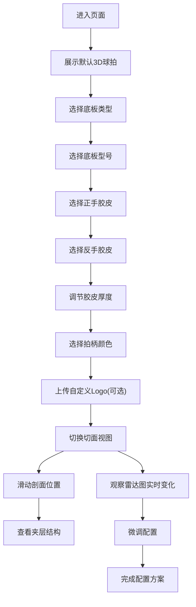

## 1. 产品概述
乒乓球拍3D配置器是一款面向乒乓球爱好者的在线交互式选拍工具，解决用户仅通过参数表选购球拍导致手感偏差、退换货率高的痛点。通过3D可视化展示球拍结构，结合实时参数计算，让用户在购买前直观了解球拍手感。

- 目标用户：乒乓球爱好者、初学者到进阶选手、器材发烧友
- 核心价值：可视化配置 + 实时参数反馈 + 结构切面展示

## 2. 核心功能

### 2.1 用户角色
| 角色 | 注册方式 | 核心权限 |
|------|----------|----------|
| 普通用户 | 无需注册 | 浏览配置、导出配置方案、上传自定义Logo |

### 2.2 功能模块
1. **3D场景主视图**：球拍模型展示、旋转缩放交互、切面视图切换
2. **左侧配置面板**：底板选择、胶皮选择、拍柄配色、Logo上传
3. **右侧参数面板**：参数雷达图、规格参数表、切面滑块控制

### 2.3 页面详情
| 页面名称 | 模块名称 | 功能描述 |
|----------|----------|----------|
| 主配置页 | 3D球拍模型 | 支持鼠标旋转、滚轮缩放、右键平移 |
| 主配置页 | 底板选择器 | 3类材质(纯木/碳素/芳基)×3款型号，缩略图预览 |
| 主配置页 | 胶皮选择器 | 正反独立选择，涩性/黏性各4款，厚度调节 |
| 主配置页 | 拍柄配色 | 6种颜色选择，实时渲染 |
| 主配置页 | Logo上传 | PNG透明底，自动贴合拍面弧面 |
| 主配置页 | 参数雷达图 | 速度/旋转/控制/弹性/重量五维，200ms内更新 |
| 主配置页 | 切面视图 | 滑块控制剖面位置，展示夹层结构 |

## 3. 核心流程

用户进入页面 → 默认配置展示 → 选择底板类型和型号 → 选择正手胶皮 → 选择反手胶皮 → 调节胶皮厚度 → 选择拍柄颜色 → 可选上传自定义Logo → 切换切面视图查看内部结构 → 参考实时雷达图微调 → 获得最终配置方案

## 4. 用户界面设计

### 4.1 设计风格
- **设计方向**：运动科技感 + 专业器材风
- **主色调**：深炭灰 `#1A1A2E` 背景 + 乒乓球橙 `#FF6B35` 强调色 + 球台蓝 `#165DFF` 辅助色
- **按钮风格**：圆角矩形 8px，悬浮有发光效果
- **字体**：标题用 "Orbitron" 科技感字体，正文用 "Noto Sans SC"
- **布局风格**：三栏式布局，左右固定面板 + 中央自适应3D场景
- **图标**：使用 lucide-react 线性图标

### 4.2 页面设计概览
| 页面名称 | 模块名称 | UI元素 |
|----------|----------|--------|
| 主配置页 | 3D场景区 | 深灰色背景、柔和聚光灯、地面反射、球拍居中悬浮 |
| 主配置页 | 左侧面板 | 深色玻璃拟态、标签页切换(底板/胶皮/外观)、卡片式选择 |
| 主配置页 | 右侧面板 | 深色玻璃拟态、雷达图居中、规格表网格、切面滑块 |
| 主配置页 | 顶部栏 | Logo、配置名称输入、重置/导出按钮 |

### 4.3 响应式
- 桌面端优先(1280px+)：三栏完整布局
- 平板端(768-1279px)：左右面板折叠为抽屉式
- 移动端(<768px)：单列布局，3D场景优先，面板Tab切换

### 4.4 3D场景指引
- **环境**：深灰色渐变背景，柔和环境光 + 聚光灯组合
- **光照**：Key Light(右上45°橙色暖光) + Fill Light(左下蓝色冷光) + Rim Light(后方轮廓光)
- **相机**：PerspectiveCamera，初始距离3，fov 45°，OrbitControls环绕
- **组合**：球拍居中悬浮，下方微弱投影，周围留出旋转空间
- **交互**：OrbitControls旋转缩放，双击重置视角，切面模式下限制旋转轴
- **后处理**：Bloom发光效果(边缘)、轻微SSAO环境遮蔽、FXAA抗锯齿
- **性能**：模型面数控制在5万面以内，LOD动态减面，纹理压缩

