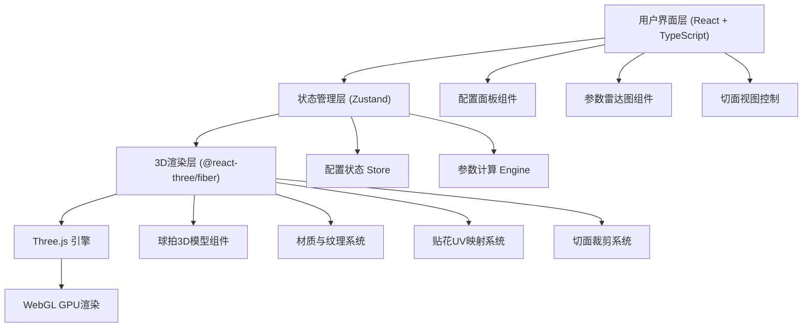

## 1. 架构设计



## 2. 技术说明

- **前端框架**：React@18 + TypeScript@5 + Vite@5
- **3D渲染**：Three@0.160 + @react-three/fiber@8 + @react-three/drei@9 + @react-three/postprocessing@2
- **UI框架**：TailwindCSS@3 + lucide-react
- **状态管理**：Zustand@4
- **数据可视化**：recharts@2 (雷达图)
- **初始化工具**：vite-init (react-ts 模板)
- **后端**：无 (纯前端应用)
- **容器化**：Docker + nginx

## 3. 路由定义

| 路由 | 用途 |
|------|------|
| / | 球拍3D配置器主页面 |

## 4. 数据模型

### 4.1 数据定义

```typescript
// 底板类型
type BladeMaterial = 'wood' | 'carbon' | 'arylate';

interface BladeModel {
  id: string;
  name: string;
  material: BladeMaterial;
  layers: number;           // 层数
  thickness: number;         // 厚度 mm
  weight: number;            // 重量 g
  speed: number;             // 基础速度 0-100
  spin: number;              // 基础旋转 0-100
  control: number;           // 基础控制 0-100
  elasticity: number;        // 基础弹性 0-100
  layerStructure: Layer[];   // 夹层结构
}

interface Layer {
  name: string;
  material: string;
  thickness: number;         // mm
  color: string;             // 展示颜色
}

// 胶皮类型
type RubberType = 'sticky' | 'non-sticky';  // 黏性 / 涩性

interface RubberModel {
  id: string;
  name: string;
  type: RubberType;
  spongeThickness: number[]; // 可选海绵厚度
  speed: number;
  spin: number;
  control: number;
  elasticity: number;
  weight: number;            // g/cm²
  color: string;             // 胶皮颜色
  texture: string;           // 纹理贴图标识
}

// 完整配置
interface RacketConfig {
  blade: BladeModel;
  forehandRubber: RubberModel;
  backhandRubber: RubberModel;
  forehandSponge: number;
  backhandSponge: number;
  handleColor: string;
  logoUrl: string | null;
}

// 最终参数
interface RacketParams {
  speed: number;
  spin: number;
  control: number;
  elasticity: number;
  weight: number;            // 总重量 g
}
```

### 4.2 参数计算公式

参数计算不是简单叠加，而是考虑底板与胶皮的协同效应：

```
基础权重公式：
- 底板贡献权重：W_blade = 0.55
- 胶皮贡献权重：W_rubber = 0.45 (正手0.28 + 反手0.17)

协同效应系数：
- 碳素底板 + 黏性胶皮：速度×1.15，旋转×1.05
- 芳基底板 + 涩性胶皮：控制×1.10，弹性×1.08
- 纯木底板 + 黏性胶皮：旋转×1.20，控制×0.95
- 纯木底板 + 涩性胶皮：速度×0.90，控制×1.15

最终参数计算（以速度为例）：
Speed = (Blade.speed × W_blade + 
         Forehand.speed × W_fh × SpongeFactor_fh + 
         Backhand.speed × W_bh × SpongeFactor_bh) 
        × SynergyFactor × NormalizeFactor

海绵厚度因子：
SpongeFactor = 0.85 + (thickness - 1.5) × 0.075
（厚度越大，速度/弹性越高，控制越低）

重量计算：
TotalWeight = Blade.weight + 
              Forehand.area(≈45cm²) × Forehand.weight × (1 + thickness/10) + 
              Backhand.area(≈45cm²) × Backhand.weight × (1 + thickness/10)
```

## 5. 项目结构

```
├── src/
│   ├── components/
│   │   ├── racket3d/          # 3D球拍相关组件
│   │   │   ├── RacketScene.tsx      # 场景容器
│   │   │   ├── Racket.tsx           # 球拍主体模型
│   │   │   ├── Blade.tsx            # 底板模型（含夹层）
│   │   │   ├── Rubber.tsx           # 胶皮模型
│   │   │   ├── Handle.tsx           # 拍柄模型
│   │   │   ├── Decal.tsx            # Logo贴花
│   │   │   └── ClippingPlane.tsx    # 切面控制
│   │   ├── panels/
│   │   │   ├── ConfigPanel.tsx      # 左侧配置面板
│   │   │   ├── BladeSelector.tsx    # 底板选择器
│   │   │   ├── RubberSelector.tsx   # 胶皮选择器
│   │   │   ├── AppearancePanel.tsx  # 外观设置（颜色/Logo）
│   │   │   ├── ParamsPanel.tsx      # 右侧参数面板
│   │   │   ├── RadarChart.tsx       # 雷达图
│   │   │   └── SpecsTable.tsx       # 规格参数表
│   │   └── layout/
│   │       └── AppLayout.tsx        # 主布局
│   ├── store/
│   │   └── useRacketStore.ts        # Zustand状态管理
│   ├── data/
│   │   ├── blades.ts                # 底板数据
│   │   └── rubbers.ts               # 胶皮数据
│   ├── utils/
│   │   ├── calcParams.ts            # 参数计算引擎
│   │   └── decalMapping.ts          # 贴花UV映射工具
│   ├── types/
│   │   └── index.ts                 # 类型定义
│   ├── hooks/
│   │   └── useRacketAnimation.ts    # 动画钩子
│   ├── pages/
│   │   └── Configurator.tsx         # 主页面
│   ├── App.tsx
│   ├── main.tsx
│   └── index.css
├── docker-compose.yml
├── Dockerfile
└── nginx.conf
```

## 6. 贴花UV映射说明

```
球拍拍面采用标准椭球UV展开：

1. UV坐标系：
   - U轴：沿拍面横向 (-1 ~ +1)，中心为拍柄方向
   - V轴：沿拍面纵向 (-1 ~ +1)，顶部为拍头

2. 映射公式：
   球拍表面3D坐标 P(x,y,z) → UV(u,v)
   - u = atan2(x, z) / π  (横向角度归一化)
   - v = (y - yMin) / (yMax - yMin)  (纵向位置归一化)

3. Logo贴合流程：
   - 用户上传PNG（自动检测Alpha通道）
   - 创建CanvasTexture，启用premultipliedAlpha
   - 使用DecalGeometry包裹椭球面，限制贴花区域在拍面中央70%
   - 纹理采样时进行椭球面法线修正，避免边缘拉伸

4. 边缘羽化：
   在片元着色器中根据到拍面边缘的距离对Alpha通道做
   smoothstep(0.85, 0.95, edgeDistance) 处理，实现自然过渡
```

## 7. Docker部署配置

```yaml
# docker-compose.yml
services:
  racket-configurator:
    build: .
    ports:
      - "8080:80"
    restart: unless-stopped
```

Dockerfile采用多阶段构建：
- Stage 1: node:20-alpine 构建前端静态文件
- Stage 2: nginx:alpine 提供静态文件服务
